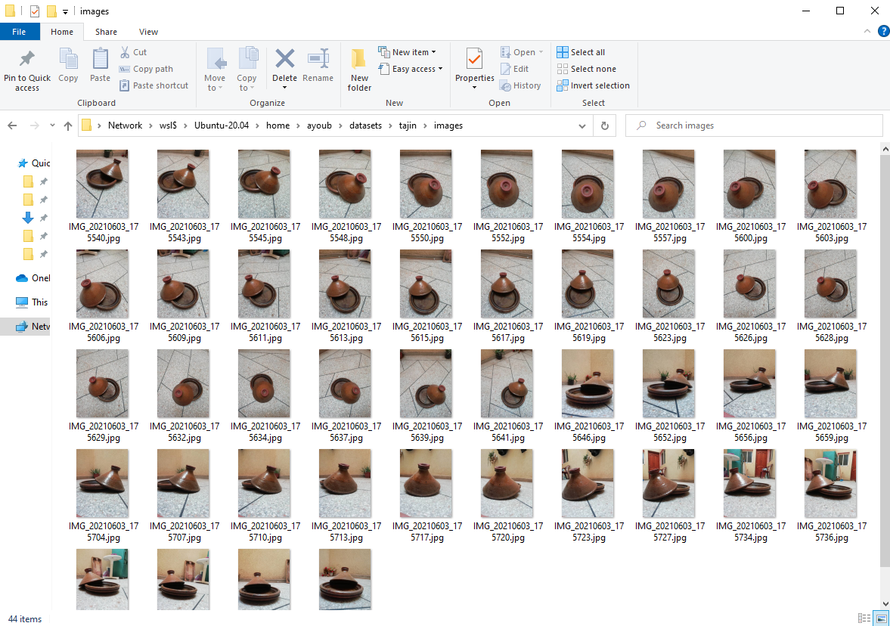
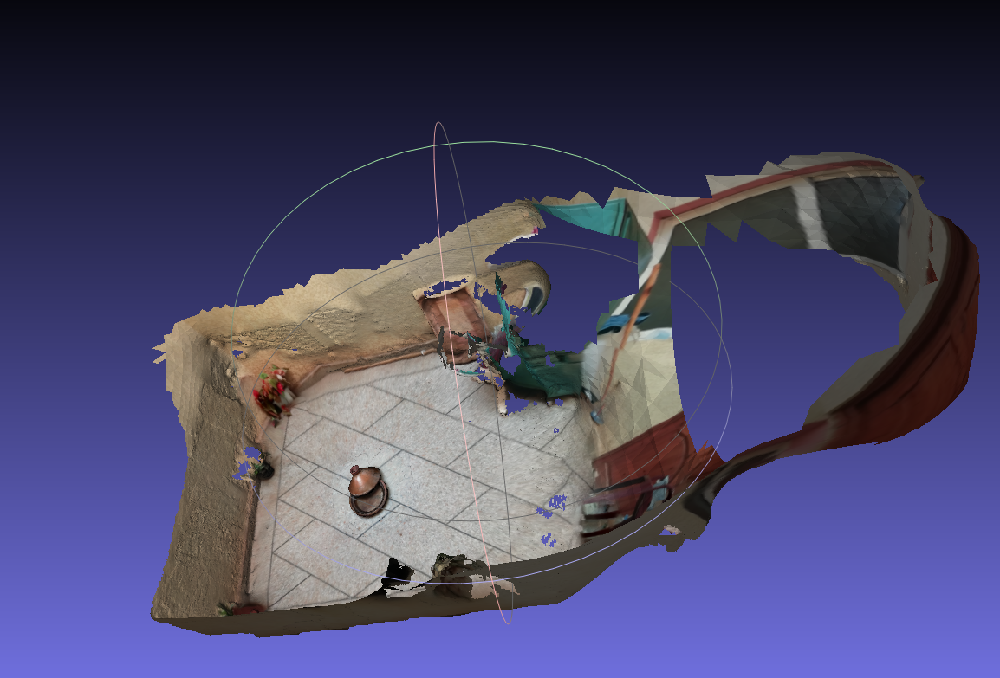
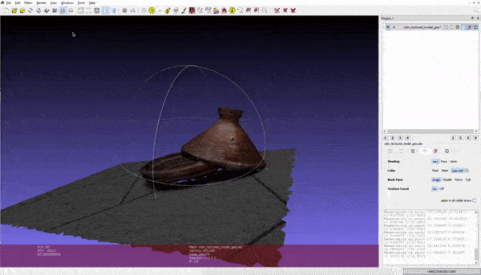

# Create 3D scene using ODM

## Prequisities:

- [x] **os: Windows 10 , wsl2 [installation guide](https://docs.microsoft.com/en-us/windows/wsl/install-win10)**
- [x] **Docker Desktop**, [install from here](https://docs.docker.com/get-docker/).
- [x] **MeshLab**, [install from here](https://www.meshlab.net/#download)

## Setting up OpenDroneMap

- Install docker desktop

- Run from the following command in terminal to download odm image to your loacal machine _(1,5 Gb approxm.)_:

```
docker pull opendronemap/odm
```

## Building the 3D model

- Place some images (JPEGs or TIFFs) in a folder named “images” in a project folder in the datasets folder in the home directory (for example `/home/youruser/datasets/project/images`)
<center>

</center>

- Run the following command

```
docker run -ti --rm -v /home/youruser/datasets:/datasets opendronemap/odm --project-path /datasets project
```

_This command will be used all the time, for the first time it will download the docker image to your machine (1,5 Gb approxm.)._

## Viewing the model:

When the process finishes, the results will be organized as follows:

<pre>
|-- images/
    |-- img-1234.jpg
    |-- ...
|-- opensfm/
    |-- see mapillary/opensfm repository for more info
|-- odm_meshing/
    |-- odm_mesh.ply                    # A 3D mesh
|-- odm_texturing/
    |-- odm_textured_model.obj          # Textured mesh
    |======================================================================
    <b>|-- odm_textured_model_geo.obj      # Georeferenced textured mesh</b>  ||
    |======================================================================
|-- odm_georeferencing/
    |-- odm_georeferenced_model.laz     # LAZ format point cloud
|-- odm_orthophoto/
    |-- odm_orthophoto.tif              # Orthophoto GeoTiff
</pre>

Open the textured model (odm_textured_model_geo.obj) or the mesh using [MeshLab](https://www.meshlab.net/) (open source system for processing and editing 3D triangular meshes).

### First result:

<center>

</center>

### Final result:

After some editing on MeshLab, here are the final results:

<center>

</center>
